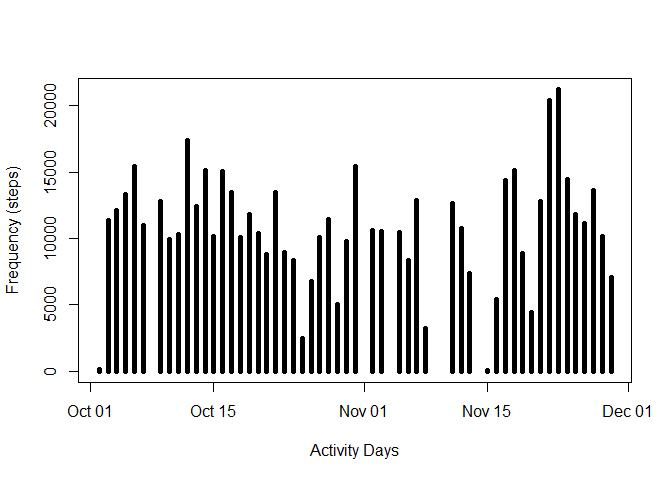
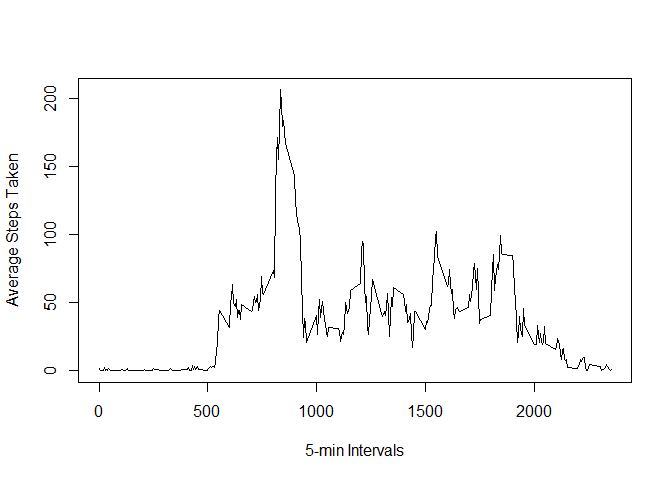
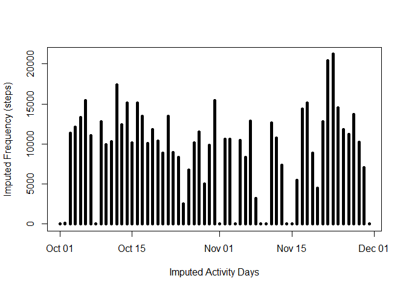
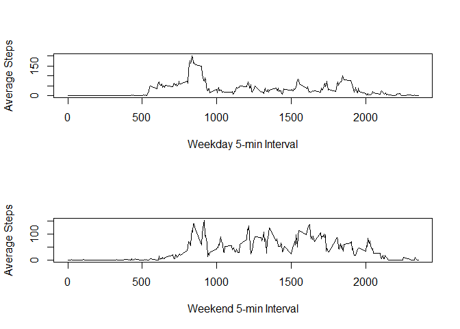

# Reproducible Research: Peer Assessment 1

## Loading and preprocessing the data
1.  Load the data


```r
##Set working directory 
setwd("C:/Users/david/Desktop/reproducibleresearch/courseproject1")

##download activity file
download.file("https://d396qusza40orc.cloudfront.net/repdata%2Fdata%2Factivity.zip","activity.zip")

##unzip activity file
unzip("activity.zip") 

##load activity file into df
df <- read.csv("activity.csv",sep=",")
```

2. Process/transform the data (if necessary) into a format suitable for your analysis
    

```r
##Convert date to as.Date data type
df$date <- as.Date(df$date)
```
    

```r
##Provide information about data frame df
str(df)
```

```
## 'data.frame':	17568 obs. of  3 variables:
##  $ steps   : int  NA NA NA NA NA NA NA NA NA NA ...
##  $ date    : Date, format: "2012-10-01" "2012-10-01" ...
##  $ interval: int  0 5 10 15 20 25 30 35 40 45 ...
```
    

```r
##Print top records in data frame
head(df)
```

```
##   steps       date interval
## 1    NA 2012-10-01        0
## 2    NA 2012-10-01        5
## 3    NA 2012-10-01       10
## 4    NA 2012-10-01       15
## 5    NA 2012-10-01       20
## 6    NA 2012-10-01       25
```
    

```r
##Print last records in data frame
tail(df)
```

```
##       steps       date interval
## 17563    NA 2012-11-30     2330
## 17564    NA 2012-11-30     2335
## 17565    NA 2012-11-30     2340
## 17566    NA 2012-11-30     2345
## 17567    NA 2012-11-30     2350
## 17568    NA 2012-11-30     2355
```

## What is mean total number of steps taken per day?

1. Calculate the total number of steps per day

```r
total <- aggregate(steps ~ date, df, sum )
```

2.  Make a histogram of the total number of steps taken per day

```r
plot(total$steps ~ total$date, type="h", lwd = 5, ylab="Frequency (steps)", xlab="Activity Days")
```

<!-- -->

3. Calculate and report the mean and median of the total number of steps taken per day


```r
mean(total$steps)
```

```
## [1] 10766.19
```


```r
median(total$steps)
```

```
## [1] 10765
```

## What is the average daily activity pattern?

1.  Make a time series plot (i.e. type = "l") of the 5-minute interval (x-axis)
    and the average number of steps taken, averaged across all days (y-axis)


```r
##calculate mean steps by interval 
df_interval <- aggregate(steps ~ interval, df, mean)
##plot line chart and label
plot(df_interval$steps ~ df_interval$interval, type="l", xlab="5-min Intervals", ylab="Average Steps Taken") 
```

<!-- -->

2.  Which 5-minute interval, on average across all the days in the dataset,
    contains the maximum number of steps?


```r
##select interval which contains maximum number of steps
max_steps <- max(df_interval$steps)
df_interval$interval[df_interval$steps==max_steps]
```

```
## [1] 835
```

## Imputing missing values

1. Calculate and report the total number of missing values in the dataset


```r
sum(is.na(df$steps))
```

```
## [1] 2304
```
2. Devise a strategy for filling in all of the missing values in the dataset.

    Fill in missing values(NA)  with 0

3. Create a new dataset that is equal tothe original 
  dataset then replace missing data (NA) with 0.


```r
df_imputed <- df
df_imputed$steps[is.na(df_imputed$steps)] <- 0
```
    

```r
##Make sure there are no more NA's
sum(is.na(df_imputed$steps))
```

```
## [1] 0
```

4.  Make a histogram of the total number of steps taken each day
     

```r
##sum the steps per day in total_imputed 
total_imputed  <- aggregate(steps ~ date, df_imputed, sum)
##plot histogram and label
plot(total_imputed$steps ~ total_imputed$date, type="h", lwd = 5, ylab="Imputed Frequency (steps)", xlab="Imputed Activity Days")  
```

<!-- -->

Calculate and report the mean and median total number of steps taken per day.


```r
mean(total_imputed$steps)
```

```
## [1] 9354.23
```


```r
median(total_imputed$steps)
```

```
## [1] 10395
```

     d. Do these values differ from the estimates
        from the first part of the assignment?
     
     Yes

     e. What is the impact of imputing missing data on the
       estimates of the total daily number of steps?

     Both estimates decreased:
           mean decreased from 10766,19 to 9354.23
           median decreased from 10765 to 10395

## Are there differences in activity patterns between weekdays and weekends?

1.  Create a new factor variable in the dataset with two levels - "weekday"  
   and "weekend" indicating whether a given date is a weekday or weekend day.
    

```r
##create vector wkdays 
wkdays <- c('Monday', 'Tuesday', 'Wednesday', 'Thursday', 'Friday')

##convert to `factor` and specify the `levels/labels`
df_imputed$partofweek <-  factor((weekdays(df_imputed$date) %in% wkdays)+1L,
                              levels=1:2, labels=c('weekend', 'weekday'))
##sum steps for 'weekend' and 'weekday'
aggregate(steps ~ partofweek, df_imputed, sum, na.rm=TRUE)
```

```
##   partofweek  steps
## 1    weekend 173692
## 2    weekday 396916
```

2.  Make a panel plot containing a time series plot (i.e. type = "l")
    of the 5-minute interval (x-axis) and the average number of steps taken,
    averaged across all weekday days or weekend days (y-axis). 
         

```r
##Make two panel plot
par(mfrow=c(2,1))

##Subset weekday data 
weekday <- df_imputed[df_imputed$partofweek=="weekday",]
##calculate weekday mean
wkday_interval <- aggregate(steps ~ interval, weekday, mean, na.rm=TRUE)
##plot average interval graph for weekdays
plot(wkday_interval$steps ~ wkday_interval$interval, type="l", xlab="Weekday 5-min Interval", ylab="Average Steps")

##Subset weekend data  
weekend <- df_imputed[df_imputed$partofweek=="weekend",]
##calculate weekend mean
wkend_interval <- aggregate(steps ~ interval, weekend, mean, na.rm=TRUE)
##plot the average interval graph for weekends
plot(wkend_interval$steps ~ wkend_interval$interval, type="l", xlab="Weekend 5-min Interval", ylab="Average Steps")
```

<!-- -->
